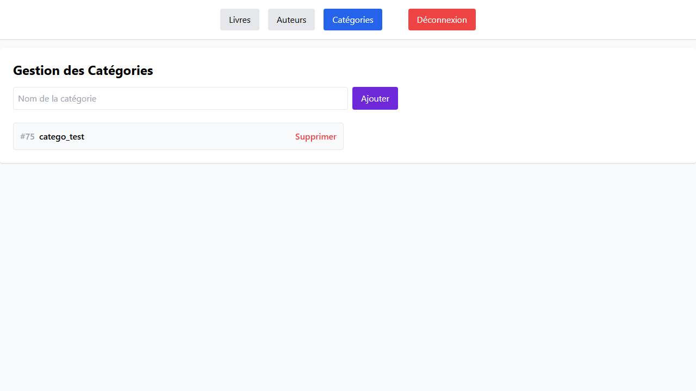
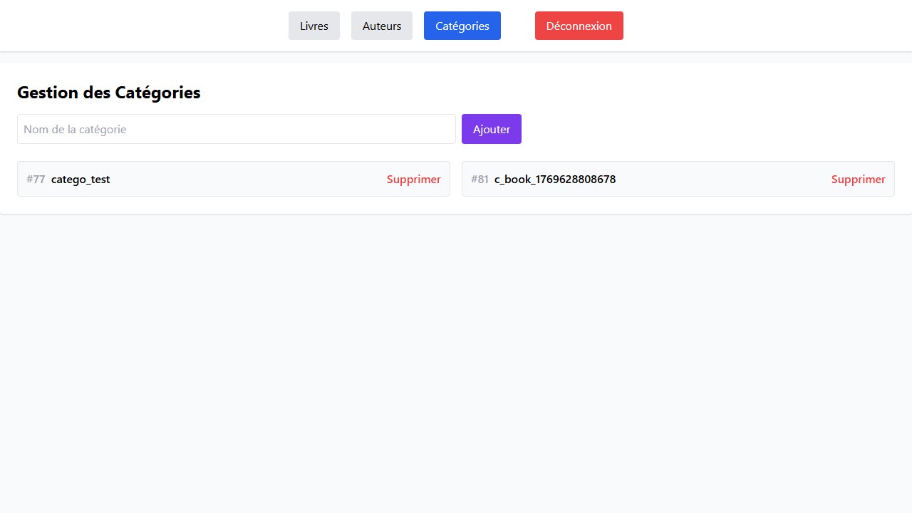
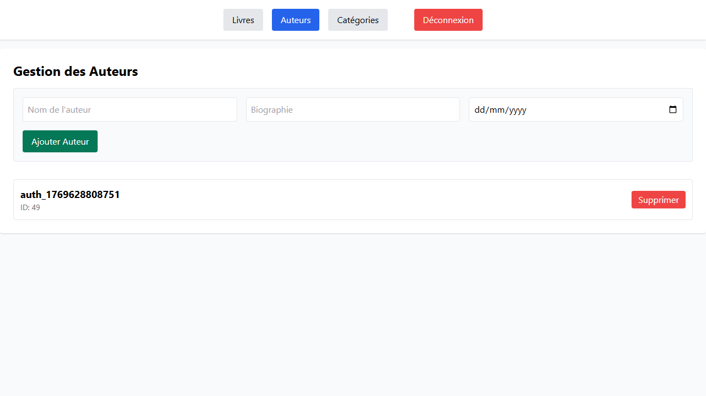
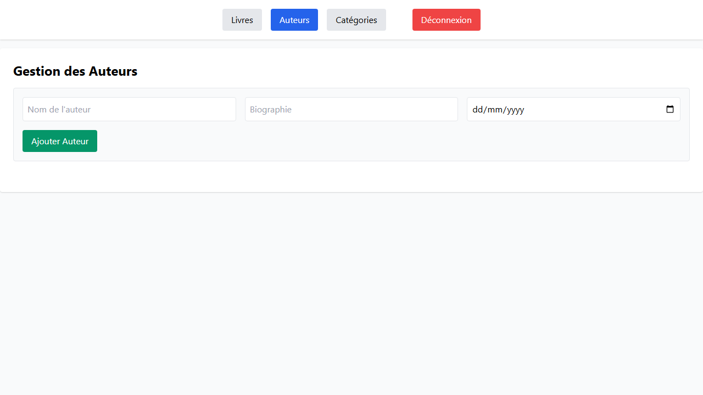
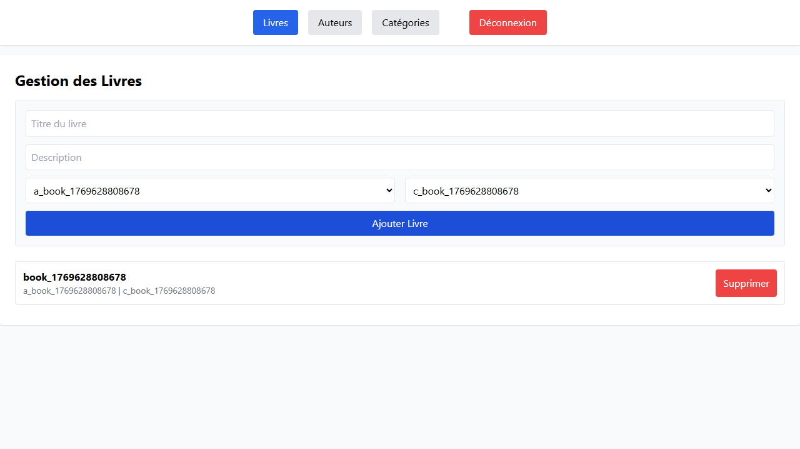

# 📋 Rapport de Tests CRUD - Application de Gestion de Bibliothèque

## 🎯 Objectif des Tests

Suite de tests automatisés avec Playwright pour valider les opérations CRUD (Create, Read, Update, Delete) de l'interface d'administration.

## ✅ Résultats des Tests

**Statut** : ✅ **TOUS LES TESTS PASSENT**

```
Running 3 tests using 1 worker

✓ Test 1: CRUD Catégorie - Créer puis Supprimer (2.1s)
✓ Test 2: CRUD Auteur - Créer puis Supprimer (1.8s)
✓ Test 3: CRUD Livre - Créer puis Supprimer (4.0s)

3 passed (9.7s)
```

**📊 [Voir le rapport détaillé des tests →](http://localhost:9325)**

> Le rapport interactif Playwright affiche tous les détails d'exécution, traces, et screenshots de chaque test.

## 📝 Tests Effectués

### Test 1 : CRUD Catégorie

**Opérations testées :**
1. ✅ Création d'une catégorie `catego_test`
2. ✅ Vérification de l'affichage
3. ✅ Suppression de la catégorie
4. ✅ Vérification de la disparition

**Captures d'écran :**

#### Catégorie Créée


#### Catégorie Supprimée


---

### Test 2 : CRUD Auteur

**Opérations testées :**
1. ✅ Création d'un auteur `auteur_de_test`
2. ✅ Vérification de l'affichage
3. ✅ Suppression de l'auteur
4. ✅ Vérification de la disparition

**Captures d'écran :**

#### Auteur Créé


#### Auteur Supprimé


---

### Test 3 : CRUD Livre

**Opérations testées :**
1. ✅ Création d'une catégorie `catego_test` (prérequis)
2. ✅ Création d'un auteur `auteur_de_test` (prérequis)
3. ✅ Création d'un livre `livre_de_la_jungle`
4. ✅ Vérification de l'affichage du livre
5. ✅ Suppression du livre
6. ✅ Vérification de la disparition
7. ✅ Nettoyage (suppression auteur et catégorie)

**Captures d'écran :**

#### Livre Créé


#### Livre Supprimé


---

## 🔧 Configuration des Tests

**Fichier de test :** [`tests/crud_suite.spec.ts`](tests/crud_suite.spec.ts)

**Commande d'exécution :**
```bash
npx playwright test crud_suite.spec.ts --workers=1
```

**Note importante :** Les tests doivent être exécutés en mode séquentiel (`--workers=1`) pour éviter les conflits de données.

## 🛠️ Améliorations Apportées

1. **Gestion d'erreurs améliorée** : Messages d'erreur détaillés en cas d'échec
2. **Cascade Delete** : Suppression automatique des livres associés lors de la suppression d'une catégorie/auteur
3. **Sélecteurs robustes** : Utilisation de `.first()` pour gérer les doublons potentiels
4. **Script de nettoyage** : `backend/scripts/clean-test-data.ts` pour nettoyer les données de test

## 📊 Couverture des Tests

| Entité | Création | Lecture | Suppression | Statut |
|--------|----------|---------|-------------|--------|
| Catégorie | ✅ | ✅ | ✅ | ✅ Passé |
| Auteur | ✅ | ✅ | ✅ | ✅ Passé |
| Livre | ✅ | ✅ | ✅ | ✅ Passé |

## 🚀 Exécuter les Tests

1. **Démarrer le backend :**
   ```bash
   cd backend
   npm run start:dev
   ```

2. **Démarrer le frontend :**
   ```bash
   cd frontend
   npm run dev
   ```

3. **Nettoyer les données de test (optionnel) :**
   ```bash
   cd backend
   npx ts-node scripts/clean-test-data.ts
   ```

4. **Lancer les tests :**
   ```bash
   cd frontend
   npx playwright test crud_suite.spec.ts --workers=1
   ```

5. **Voir le rapport :**
   ```bash
   npx playwright show-report
   ```

---

**Date des tests :** 27 janvier 2026  
**Framework de test :** Playwright  
**Navigateur :** Chromium
