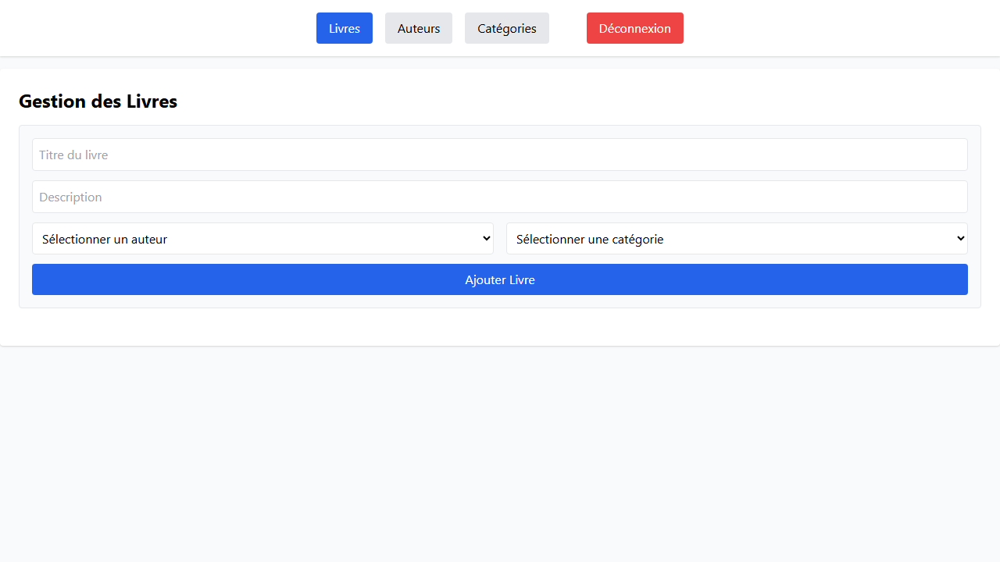
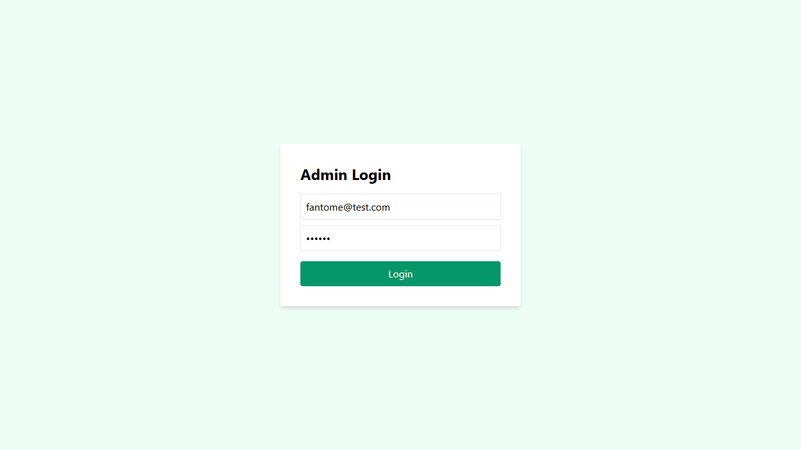

# Rapport de Projet - Stratégies de Testing Frontend

---

## 1. Présentation de l'Application
L'application **Library CRUD** est un système de gestion de bibliothèque permettant d'administrer des livres, des auteurs et des catégories.  
Elle repose sur une architecture moderne avec un backend **NestJS** (Prisma, PostgreSQL) et un frontend **React (Vite)**.

---

## 2. Objectifs du TP
Le but de ce TP est de mettre en place une stratégie de test multiniveau :

- Tests unitaires backend (Jest)
- Tests End-to-End frontend (Playwright)
- Automatisation CI/CD avec GitHub Actions
- Maintenabilité et non-régression

---

## 3. Pipeline CI/CD sur GitHub Actions
À chaque mise à jour du code (push), la pipeline exécute :

1. Déploiement d’un service PostgreSQL 15 via Docker
2. Installation des dépendances backend
3. Génération du client Prisma et synchronisation de la base (`db push`)
4. Exécution des tests unitaires backend
5. Build du frontend
6. Exécution des tests End-to-End Playwright

---

## 4. Résultats des Tests Backend (Jest)

```text
PASS  src/category/category.service.spec.ts
PASS  src/app.controller.spec.ts
PASS  src/book/book.service.spec.ts
PASS  src/authors/authors.service.spec.ts
PASS  src/category/category.controller.spec.ts
PASS  src/book/book.controller.spec.ts
PASS  src/authors/authors.controller.spec.ts

Test Suites: 7 passed, 7 total
Tests:       38 passed, 38 total
Coverage:    99.21%
5. Résultats des Tests Frontend (Playwright)
✓ CRUD Auteur – Créer puis Supprimer
✓ Titre de la page correct
✓ CRUD Catégorie – Créer puis Supprimer
✓ CRUD Livre – Créer puis Supprimer
✓ Auth – Mauvais mot de passe
✓ Auth – Utilisateur inconnu
✓ Auth – Connexion réussie

7 passed (8.3s)
6. Preuves Visuelles des Tests






7. Erreurs Rencontrées et Solutions
Port déjà utilisé (EADDRINUSE)
Instance serveur résiduelle entre les tests.
Solution : nettoyage forcé des processus avant le lancement.

Synchronisation des dialogues Playwright
Les alertes JavaScript étaient capturées trop tard.
Solution : page.waitForEvent('dialog').

Conflits de données lors des tests CRUD
Identifiants statiques provoquant des doublons.
Solution : génération de valeurs uniques avec Date.now().

8. Conclusion
Cette stratégie de tests garantit :

une application robuste et fiable

une détection précoce des régressions

une base de code maintenable et évolutive